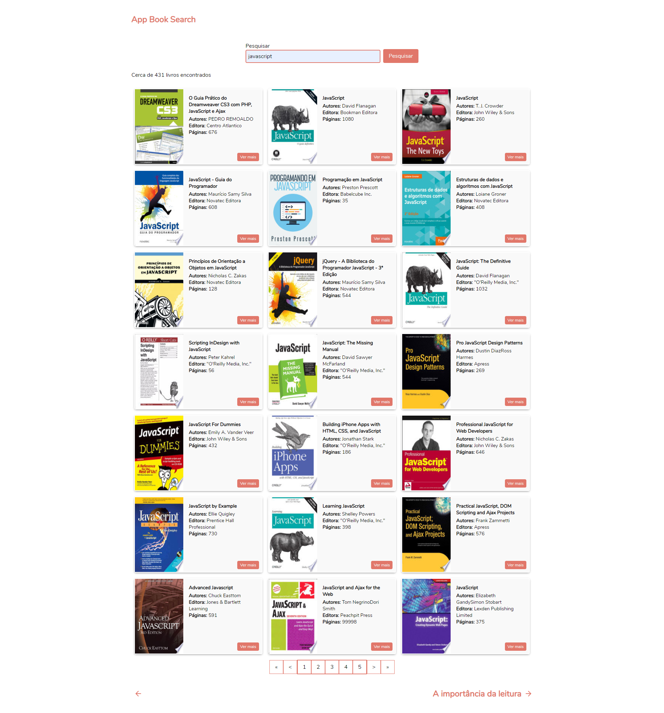

# app-book-search
App para busca de livros, utilizando Google Books API

Deploy realizado: https://app-book-search.herokuapp.com/

------------------------------------------------------

  
  

  
  

------------------------------------------------------

## Encontre os livros que você procura

**Você não precisa saber o nome do livro, se você souber o nome do autor ou editor, basta digitar e pesquisar, ou então digitar uma palavra chave.**

## 🔧 Instalação

Para clonar o projeto via HTTPS, execute este comando:

    git clone https://github.com/maiconboer/app-book-search.git

Após a finalização do clone, instale as dependências com o comando:

    yarn  

Com as instalações das dependencias finalizadas, podemos dar início a execução do projeto.

--------------------------------------

## 👷 Execução

Para iniciar a aplicação, rode o comando:

    yarn start
    
    

